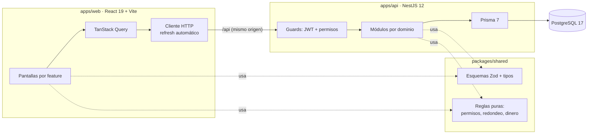

# Stock Simple

**Stock, caja y precios para skate shops y comercios chicos.** Un punto de venta rápido, stock por talle con historial de cada movimiento, aumentos masivos de precios con redondeo comercial y reportes de ventas y márgenes.

> El problema: las tiendas chicas de ropa y skate llevan el stock en un cuaderno o en Excel. No saben qué talle falta ni qué producto les deja ganancia y, con inflación, actualizar cientos de precios a mano es una tarde perdida cada cambio de temporada.

## Probalo

Después de `npm run setup` (ver abajo), la pantalla de ingreso ofrece accesos rápidos con tres usuarios de demostración. La contraseña de todos es `demo1234`:

| Rol | Email | Qué puede hacer |
| --- | --- | --- |
| Dueña | `duena@stocksimple.demo` | Todo: costos, márgenes, reportes, equipo |
| Encargado | `encargado@stocksimple.demo` | Productos, stock, precios, ventas y reportes |
| Cajera | `cajera@stocksimple.demo` | Vende y consulta precios; **no ve costos** |

El seed carga una skate shop de demo (**Shop**): 51 productos (remeras, buzos, pantalones y zapatillas con un SKU por talle, tablas, ruedas, trucks, rulemanes y accesorios) y 45 días de ventas realistas. El sábado es el día fuerte, hay un aumento de temporada en la indumentaria a mitad del período y algunas anulaciones.

## Funcionalidades

- **Punto de venta:** búsqueda instantánea y soporte para lector de código de barras (escanear + Enter agrega el producto). Carrito que sobrevive a una recarga, cálculo de vuelto con atajos de billetes y cuatro medios de pago. Barra de cobro fija en el celular.
- **Productos y stock:** catálogo con filtros guardados en la URL. Ingresos de mercadería (con actualización de costo), pérdidas con motivo y recuentos físicos. Cada movimiento queda en un libro auditable.
- **Precios:** "subí 8 % todas las remeras y redondeá a $100". Vista previa con el margen antes y después, posibilidad de excluir productos e historial de precios por producto.
- **Ventas:** historial por período, detalle con costo y ganancia (según el rol) y anulación con motivo que devuelve el stock.
- **Reportes:** ventas por día, ganancia bruta, ticket promedio, ventas por categoría y por medio de pago, y ranking de productos.
- **Equipo:** alta de usuarios, roles y desactivación (que cierra sus sesiones al instante).
- **Identidad punk de póster impreso:** blanco y tinta negra, tipografía condensada, bordes duros y sombras tipo sticker. Un único acento naranja seguridad marca solo los puntos de interacción (acción principal, foco, selección e ítem activo).
- Modo claro y oscuro, diseño responsive y accesible: contraste AA, navegación por teclado, gráficos con vista de tabla y estados que nunca dependen solo del color.

## Arquitectura



**Decisiones de arquitectura (ADRs):**

1. [Monorepo con paquete de dominio compartido](docs/adr/0001-monorepo-con-paquete-compartido.md): web y API validan con los mismos esquemas y calculan con las mismas funciones.
2. [Dinero en centavos enteros](docs/adr/0002-dinero-en-centavos-enteros.md): sin errores de punto flotante.
3. [Ventas atómicas, sin sobreventa e idempotentes](docs/adr/0003-concurrencia-en-ventas.md): `UPDATE` condicional, bloqueo ordenado y clave de idempotencia.
4. [Sesión con refresh token rotativo en cookie httpOnly](docs/adr/0004-sesion-con-refresh-token-en-cookie.md), con detección de reutilización.
5. [Permisos por rol en un solo lugar](docs/adr/0005-permisos-por-rol-en-un-solo-lugar.md) y aislamiento entre comercios (multi-tenant).

### Stack

| Capa | Tecnología |
| --- | --- |
| Web | React 19, TypeScript, Vite, React Router 7, TanStack Query 5, React Hook Form + Zod, CSS Modules con design tokens |
| API | NestJS 12, Prisma 7 (adapter `pg`), PostgreSQL 17, JWT + argon2, Swagger, rate limiting, Helmet |
| Compartido | Zod 4 (esquemas, tipos y mensajes en español) |
| Calidad | Vitest, Testing Library, MSW, Supertest, Playwright, oxlint, GitHub Actions |

Sin librerías de componentes ni de gráficos: los gráficos son SVG propio, los diálogos usan `<dialog>` nativo y las notificaciones usan la Popover API.

### Estructura

```
stock-simple/
├── packages/shared/src/      Esquemas Zod, DTOs y reglas puras (con tests)
├── apps/api/
│   ├── prisma/               Esquema, migraciones y seed de demo
│   ├── src/<dominio>/        auth, users, categories, products, stock, sales, pricing, reports
│   ├── src/common/           Validación Zod, filtro de errores, fechas por zona horaria
│   └── test/                 Tests e2e contra Postgres real
├── apps/web/
│   ├── src/app/              Router, guards, layout y navegación por permisos
│   ├── src/features/<x>/     Una carpeta por funcionalidad: pantallas, hooks de datos y lógica
│   ├── src/shared/           UI base, gráficos, hooks y helpers reutilizables
│   └── e2e/                  Tests de punta a punta (Playwright)
└── docs/adr/                 Decisiones de arquitectura
```

## Cómo correrlo

Requisitos: **Node 22+** y **Docker** (para PostgreSQL).

```bash
npm install
cp apps/api/.env.example apps/api/.env
npm run setup        # levanta Postgres, aplica migraciones y carga la demo
```

Después, en dos terminales:

```bash
npm run dev:api      # http://localhost:3000/api · Swagger en /api/docs
npm run dev:web      # http://localhost:5173
```

`npm run db:seed -w @stock/api` vuelve a cargar los datos de demo (borra los actuales).

## Tests

| Comando | Qué cubre |
| --- | --- |
| `npm test` | Unitarios: reglas de dominio, helpers, carrito y componentes (Vitest + MSW) |
| `npm run test:api:e2e` | API completa contra una base de test: auth y rotación de tokens, permisos, aislamiento entre comercios, ventas concurrentes, idempotencia, anulaciones, precios |
| `npm run test:web:e2e` | Flujos reales en el navegador (Playwright, escritorio y celular), con su propia API y base de test |
| `npm run lint` · `npm run typecheck` | oxlint (reglas de React, accesibilidad y Vitest) y TypeScript estricto |

Los tests e2e usan la base `stock_simple_test`, que se crea sola con Docker. Nunca tocan los datos de desarrollo.

## Deploy (gratis)

Guía paso a paso en **[docs/DEPLOY.md](docs/DEPLOY.md)**. Todo en planes gratuitos, sin tarjeta:

- **Web → Netlify** (`netlify.toml`): build del workspace web y SPA routing. Netlify reenvía `/api/*` a la API, así la cookie de sesión es first-party.
- **API → Render** (`render.yaml`): web service gratuito, con migraciones al arrancar y health check en `/api/health`.
- **Base → Neon**: Postgres gratuito que no vence (la base gratuita de Render se borra a los 30 días).

En el plan gratuito la API se duerme sin uso. La web lo resuelve: despierta el servidor apenas se abre, muestra un aviso mientras tanto y reintenta sola las lecturas. Las escrituras no se reintentan automáticamente para no duplicarlas.

Variables de la API: ver [`apps/api/.env.example`](apps/api/.env.example). Si la configuración es inválida, la app no arranca.

## Próximos pasos

- Modo sin conexión para el POS (cola de ventas con la misma clave de idempotencia).
- Variantes agrupadas (talle y color bajo un mismo artículo; hoy cada talle es un SKU propio) y combos, como un skate armado con sus partes.
- Proveedores y órdenes de compra.
- Exportar reportes a CSV.
