# Stock Simple

**Vendé, controlá y decidí con datos.** Ventas, stock, precios y reportes en un solo lugar para tiendas chicas: punto de venta rápido, stock por talle con historial de cada movimiento, importación y conteo de inventario con planillas, aumentos masivos con redondeo comercial y reportes exportables. Monorepo full stack con **React 19 + NestJS + PostgreSQL**.

[](https://github.com/adrianGette/stock-simple/actions/workflows/ci.yml)
[](https://stock-simple-adrian.netlify.app)

### 👉 [Ver la demo en vivo](https://stock-simple-adrian.netlify.app)

Entrá con los botones de demo del login (contraseña `demo1234`). Cada rol ve una app distinta:

| Rol | Qué puede hacer |
| --- | --- |
| **Dueña** | Todo: costos, márgenes, reportes y equipo |
| **Encargado** | Productos, stock, precios, ventas y reportes |
| **Cajera** | Vende y consulta precios; **no ve costos** (ni en pantalla ni en la API) |

> La demo usa planes gratuitos: si nadie la usó en los últimos 15 minutos, el servidor tarda unos 50 segundos en despertar. La app lo avisa con "Despertando el servidor…". Las cuentas son compartidas, así que no se pueden modificar usuarios, y los datos se reinician cada madrugada.

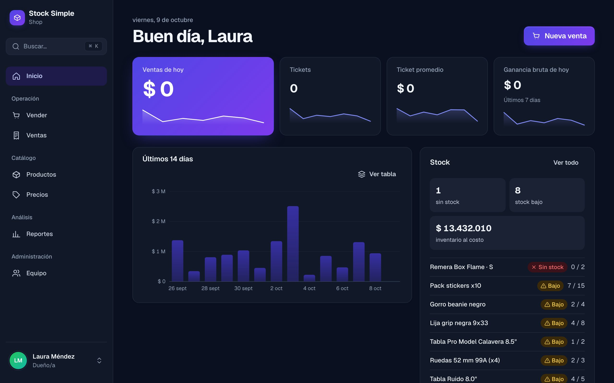

<table>
  <tr>
    <td width="50%">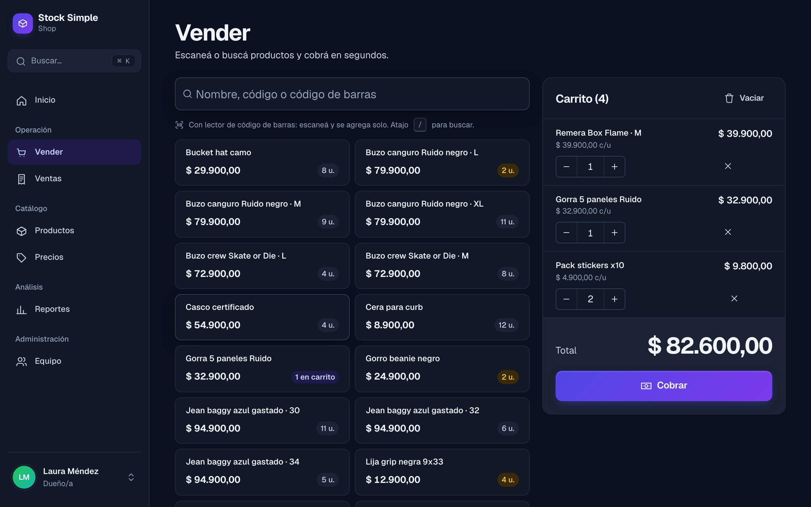<p align="center"><b>Punto de venta</b>: búsqueda, lector de código de barras y carrito</p></td>
    <td width="50%">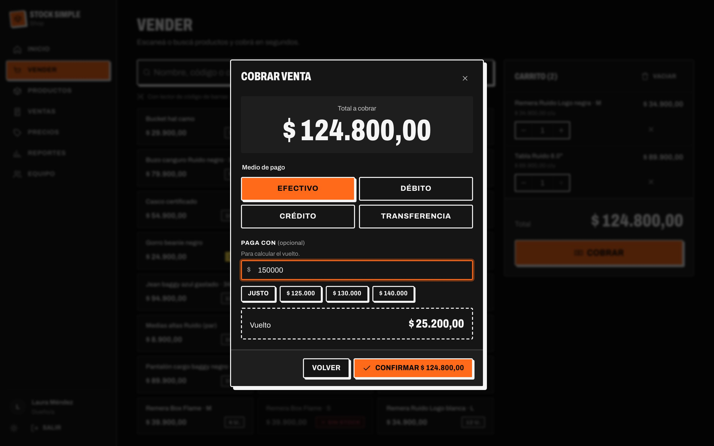<p align="center"><b>Cobro</b>: medios de pago y cálculo de vuelto</p></td>
  </tr>
  <tr>
    <td width="50%">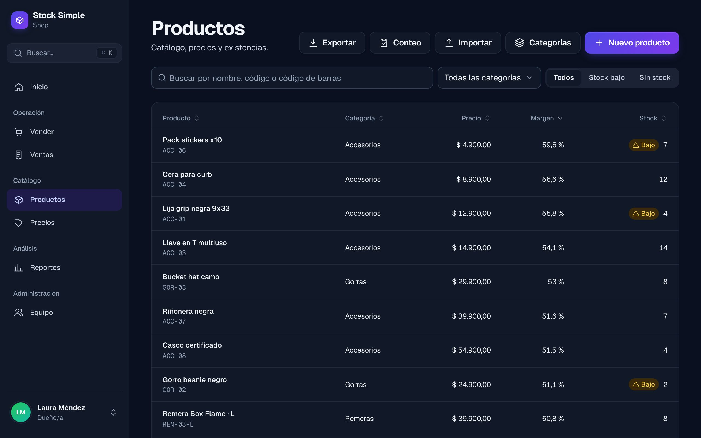<p align="center"><b>Productos</b>: filtros, orden por cualquier columna y exportación</p></td>
    <td width="50%">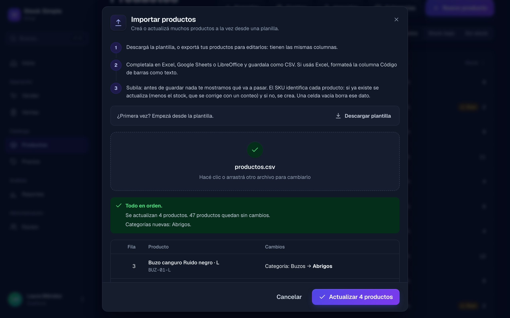<p align="center"><b>Importar</b>: vista previa de cada cambio antes de guardar</p></td>
  </tr>
  <tr>
    <td width="50%">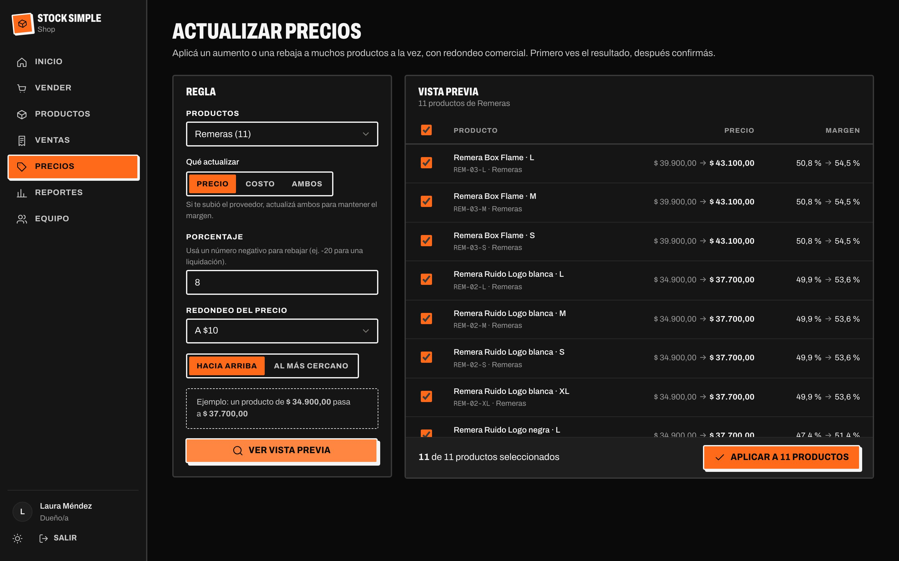<p align="center"><b>Aumentos masivos</b>: vista previa con el margen antes y después</p></td>
    <td width="50%">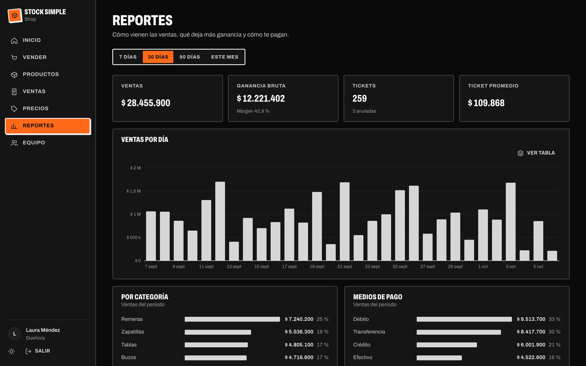<p align="center"><b>Reportes</b>: ventas por día, categoría y medio de pago, exportables a CSV</p></td>
  </tr>
  <tr>
    <td width="50%">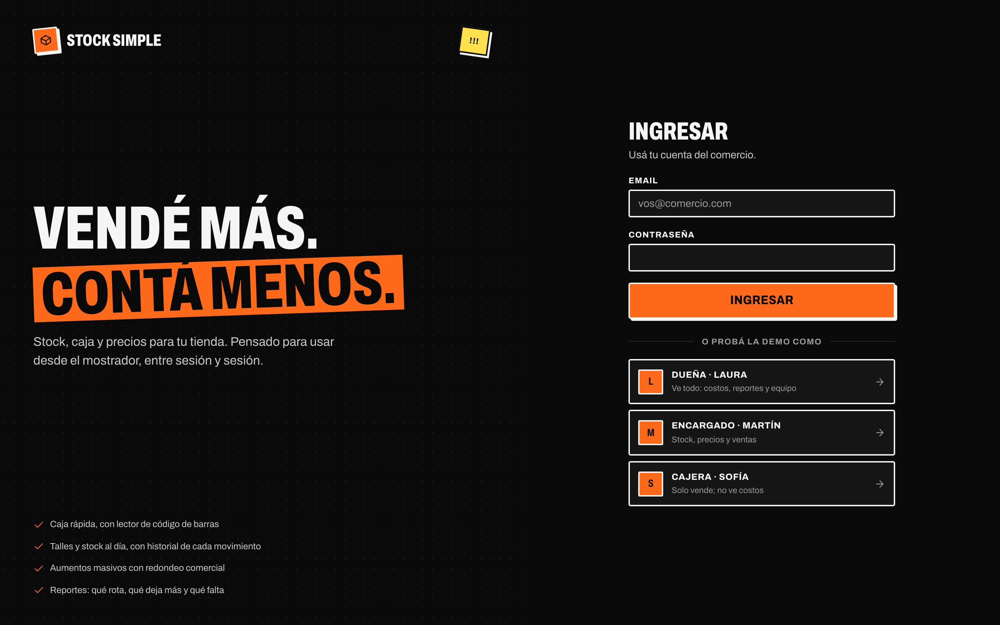<p align="center"><b>Ingreso</b>: una cuenta de demo por rol</p></td>
    <td width="50%">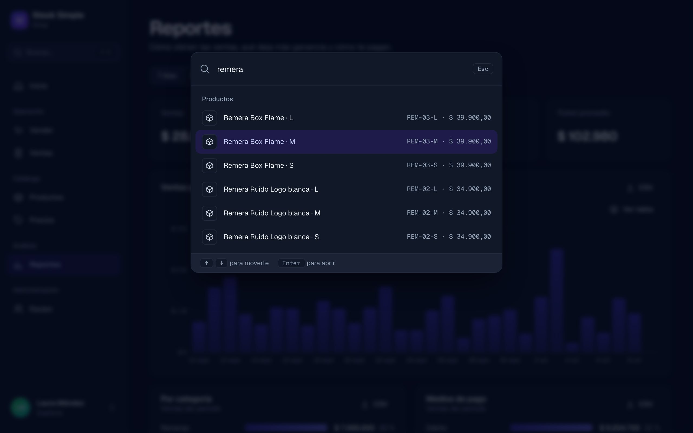<p align="center"><b>Buscador</b>: productos y pantallas con <kbd>Ctrl</kbd> + <kbd>K</kbd></p></td>
  </tr>
  <tr>
    <td width="50%">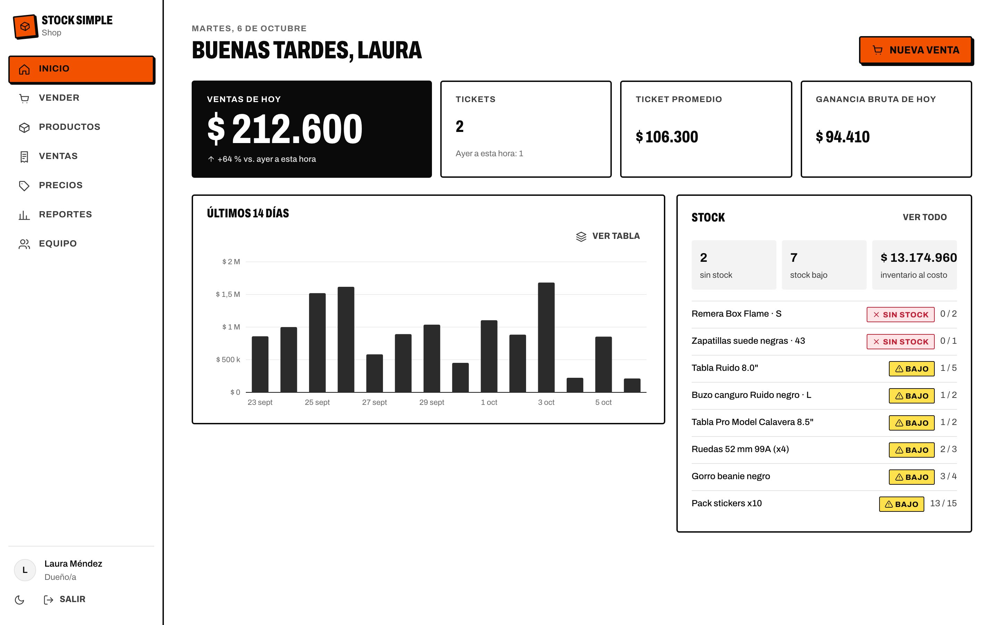<p align="center"><b>Modo claro</b></p></td>
    <td width="50%" align="center">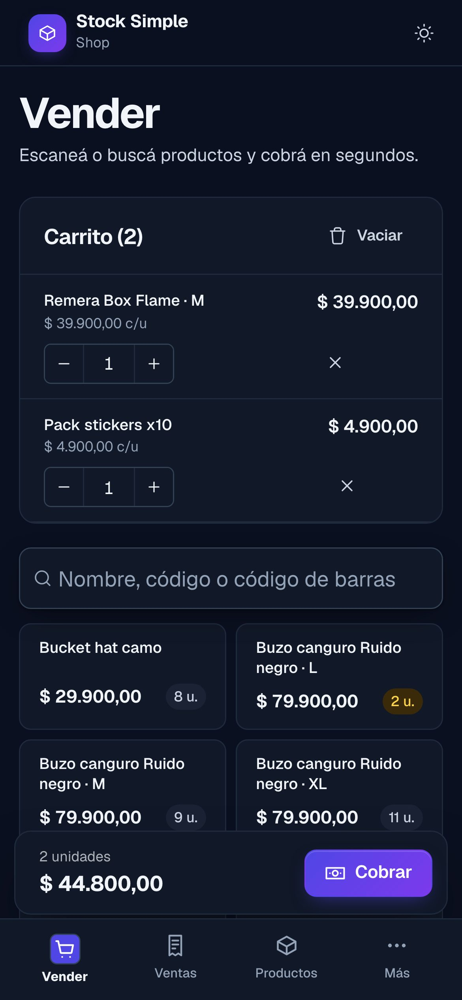<p align="center"><b>Celular</b>: barra de cobro fija y navegación inferior</p></td>
  </tr>
</table>

## El problema

Las tiendas chicas de ropa y skate llevan el stock en un cuaderno o en Excel. No saben qué talle falta ni qué producto les deja ganancia y, con inflación, actualizar cientos de precios a mano es una tarde perdida cada cambio de temporada. Stock Simple resuelve el día a día del mostrador: vender rápido, saber qué hay y qué falta, y subir precios en segundos sin errores.

## Lo más interesante técnicamente

- **Ventas que nunca venden de más:** cada venta es una transacción con descuento de stock condicional y bloqueo ordenado. Un test e2e lanza 12 ventas simultáneas sobre 5 unidades y exige que se aprueben exactamente 5 ([ADR 0003](docs/adr/0003-concurrencia-en-ventas.md)).
- **Cobros idempotentes:** si la red falla y el POS reintenta, la API devuelve la misma venta en lugar de duplicarla.
- **Una sola fuente de verdad:** web y API validan con los mismos esquemas Zod y calculan con las mismas funciones. La vista previa de un aumento muestra exactamente lo que se va a guardar ([ADR 0001](docs/adr/0001-monorepo-con-paquete-compartido.md)).
- **Seguridad:** permisos por rol aplicados en el servidor, aislamiento entre comercios, refresh token rotativo en cookie httpOnly con detección de reutilización, rate limiting, CSP y modo demo que impide tomar el control de las cuentas compartidas. Detalle y riesgos aceptados en [SECURITY.md](SECURITY.md).
- **Dinero en centavos enteros**, sin errores de punto flotante ([ADR 0002](docs/adr/0002-dinero-en-centavos-enteros.md)).
- **Unos 200 tests** (unitarios, de API contra Postgres real y Playwright en escritorio y celular) que corren en cada push con GitHub Actions.
- **Desplegado gratis** en Netlify + Render + Neon, con proxy de mismo origen y manejo del "servidor dormido" ([guía de deploy](docs/DEPLOY.md)).

## Funcionalidades

- **Punto de venta:** búsqueda instantánea y soporte para lector de código de barras (escanear + Enter agrega el producto). Carrito que sobrevive a una recarga, cálculo de vuelto con atajos de billetes y cuatro medios de pago. Barra de cobro fija en el celular.
- **Productos y stock:** catálogo con filtros y orden por cualquier columna guardados en la URL. Ingresos de mercadería (con actualización de costo), pérdidas con motivo y recuentos físicos. Cada movimiento queda en un libro auditable.
- **Planillas (Excel, Google Sheets o LibreOffice):** exportá el catálogo a CSV, editalo y volvé a importarlo para crear o actualizar productos en masa, con una vista previa de cada cambio antes de guardar. El conteo de inventario se carga igual: se imprime la planilla, se anota lo contado y se aplican solo las diferencias.
- **Precios:** "subí 8 % todas las remeras y redondeá a $100". Vista previa con el margen antes y después, posibilidad de excluir productos e historial de precios por producto.
- **Ventas:** historial por período, detalle con costo y ganancia (según el rol) y anulación con motivo que devuelve el stock.
- **Reportes:** ventas por día, ganancia bruta, ticket promedio, ventas por categoría y por medio de pago, y ranking de productos. Cada uno se descarga en CSV.
- **Equipo:** alta de usuarios, roles y desactivación (que cierra sus sesiones al instante). Cada usuario puede subir su foto de perfil o volver a sus iniciales.
- **Buscador global:** <kbd>Ctrl</kbd> + <kbd>K</kbd> (<kbd>⌘</kbd> + <kbd>K</kbd> en Mac) busca productos y pantallas desde cualquier lugar.
- **Diseño moderno y limpio:** tipografía Geist, grises *slate*, bordes finos, sombras suaves y esquinas redondeadas. El acento, con un degradado en las acciones principales y los títulos destacados, marca solo los puntos de interacción. Cada persona elige su paleta desde el menú de usuario (Índigo, Océano o Grafito), además del modo claro u oscuro.
- Modo claro y oscuro, diseño responsive y accesible: contraste AA, navegación por teclado, gráficos con vista de tabla y estados que nunca dependen solo del color.

### Datos de la demo

El seed carga una skate shop (**Shop**): 51 productos (remeras, buzos, pantalones y zapatillas con un SKU por talle, tablas, ruedas, trucks, rulemanes y accesorios) y 45 días de ventas realistas. El sábado es el día fuerte, hay un aumento de temporada en la indumentaria a mitad del período y algunas anulaciones.

## Arquitectura

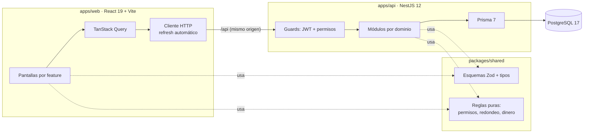

**Decisiones de arquitectura (ADRs):**

1. [Monorepo con paquete de dominio compartido](docs/adr/0001-monorepo-con-paquete-compartido.md): web y API validan con los mismos esquemas y calculan con las mismas funciones.
2. [Dinero en centavos enteros](docs/adr/0002-dinero-en-centavos-enteros.md): sin errores de punto flotante.
3. [Ventas atómicas, sin sobreventa e idempotentes](docs/adr/0003-concurrencia-en-ventas.md): `UPDATE` condicional, bloqueo ordenado y clave de idempotencia.
4. [Sesión con refresh token rotativo en cookie httpOnly](docs/adr/0004-sesion-con-refresh-token-en-cookie.md), con detección de reutilización.
5. [Permisos por rol en un solo lugar](docs/adr/0005-permisos-por-rol-en-un-solo-lugar.md) y aislamiento entre comercios (multi-tenant).

### Stack

| Capa | Tecnología |
| --- | --- |
| Web | React 19, TypeScript, Vite, React Router 7, TanStack Query 5, React Hook Form + Zod, CSS Modules con design tokens |
| API | NestJS 12, Prisma 7 (adapter `pg`), PostgreSQL 17, JWT + argon2, Swagger, rate limiting, Helmet |
| Compartido | Zod 4 (esquemas, tipos y mensajes en español) |
| Calidad | Vitest, Testing Library, MSW, Supertest, Playwright, oxlint, GitHub Actions |

Sin librerías de componentes ni de gráficos: los gráficos son SVG propio, los diálogos usan `<dialog>` nativo y las notificaciones usan la Popover API.

### Estructura

```
stock-simple/
├── packages/shared/src/      Esquemas Zod, DTOs y reglas puras (con tests)
├── apps/api/
│   ├── prisma/               Esquema, migraciones y seed de demo
│   ├── src/<dominio>/        auth, users, categories, products, stock, sales, pricing, reports
│   ├── src/common/           Validación Zod, filtro de errores, fechas por zona horaria
│   └── test/                 Tests e2e contra Postgres real
├── apps/web/
│   ├── src/app/              Router, guards, layout y navegación por permisos
│   ├── src/features/<x>/     Una carpeta por funcionalidad: pantallas, hooks de datos y lógica
│   ├── src/shared/           UI base, gráficos, hooks y helpers reutilizables
│   └── e2e/                  Tests de punta a punta (Playwright)
└── docs/adr/                 Decisiones de arquitectura
```

## Cómo correrlo

### Opción A: con Docker (un solo comando)

Requisito: **Docker**. No hace falta instalar Node.

```bash
docker compose up --build
```

Abrí **http://localhost:8080** y entrá con los botones de demo. La primera vez tarda unos minutos porque construye las imágenes.

| Servicio | Qué hace |
| --- | --- |
| `db` | PostgreSQL 17 con un volumen persistente |
| `migrate` | Tarea de única vez: aplica las migraciones y, si la base está vacía, carga la demo |
| `api` | NestJS en una imagen multi-etapa liviana: sin herramientas de build y corriendo sin privilegios de root |
| `web` | El build de React servido por nginx (también sin root), que reenvía `/api` a la API igual que Netlify en producción |

Cada servicio espera a que el anterior esté sano antes de arrancar. Para apagar todo: `docker compose down` (agregá `-v` para borrar también los datos).

### Opción B: para desarrollar (con recarga en caliente)

Requisitos: **Node 22+** y **Docker** (para PostgreSQL).

```bash
npm install
cp apps/api/.env.example apps/api/.env
npm run setup        # levanta Postgres, aplica migraciones y carga la demo
```

Después, en dos terminales:

```bash
npm run dev:api      # http://localhost:3000/api · Swagger en /api/docs
npm run dev:web      # http://localhost:5173
```

`npm run db:seed -w @stock/api` vuelve a cargar los datos de demo (borra los actuales). En local, los usuarios de demo son `duena@`, `encargado@` y `cajera@stocksimple.demo`, con contraseña `demo1234`.

## Tests

| Comando | Qué cubre |
| --- | --- |
| `npm test` | Unitarios: reglas de dominio, helpers, carrito y componentes (Vitest + MSW) |
| `npm run test:api:e2e` | API completa contra una base de test: auth y rotación de tokens, permisos, aislamiento entre comercios, ventas concurrentes, idempotencia, anulaciones, precios |
| `npm run test:web:e2e` | Flujos reales en el navegador (Playwright, escritorio y celular), con su propia API y base de test |
| `npm run lint` · `npm run typecheck` | oxlint (reglas de React, accesibilidad y Vitest) y TypeScript estricto |

Los tests e2e usan la base `stock_simple_test`, que se crea sola con Docker. Nunca tocan los datos de desarrollo.

## Deploy (gratis)

Guía paso a paso en **[docs/DEPLOY.md](docs/DEPLOY.md)**. Todo en planes gratuitos, sin tarjeta:

- **Web → Netlify** (`netlify.toml`): build del workspace web y SPA routing. Netlify reenvía `/api/*` a la API, así la cookie de sesión es first-party.
- **API → Render** (`render.yaml`): web service gratuito, con migraciones al arrancar y health check en `/api/health`.
- **Base → Neon**: Postgres gratuito que no vence (la base gratuita de Render se borra a los 30 días).
- **Releases**: los PRs se mergean a `main` (copia de prueba gratis en Netlify) y solo se publica lo que llega a `production`, con un PR de release. Al mergearlo, GitHub Actions crea el tag y el release con notas agrupadas por tipo de cambio.

En el plan gratuito la API se duerme sin uso. La web lo resuelve: despierta el servidor apenas se abre, muestra un aviso mientras tanto y reintenta sola las lecturas. Las escrituras no se reintentan automáticamente para no duplicarlas.

Variables de la API: ver [`apps/api/.env.example`](apps/api/.env.example). Si la configuración es inválida, la app no arranca.

## Próximos pasos

- Modo sin conexión para el POS (cola de ventas con la misma clave de idempotencia).
- Variantes agrupadas (talle y color bajo un mismo artículo; hoy cada talle es un SKU propio) y combos, como un skate armado con sus partes.
- Proveedores y órdenes de compra.

## Autor

Hecho por **Adrián Gette** · [GitHub](https://github.com/adrianGette)
